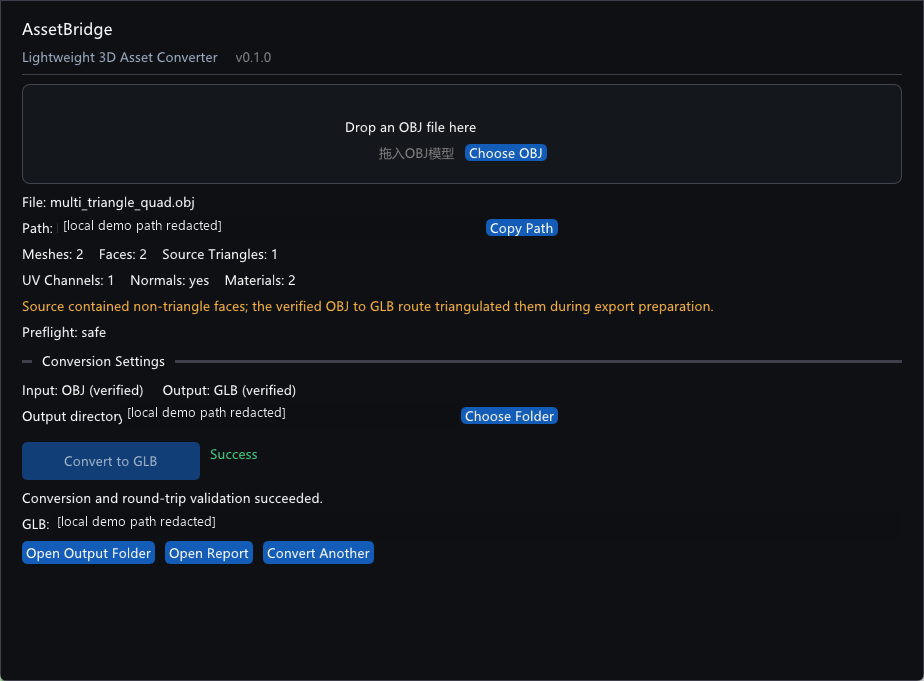

# AssetBridge

[English documentation / 英文说明](README.md)

AssetBridge 是一个轻量级 Windows 原生工具，用于检查 3D 资产并执行边界明确、
经过验证的 OBJ→GLB 工作流。项目重点不是宣称格式万能互转，而是显式描述格式能力、
转换前诊断、事务式输出和导出后回读验证。

AssetBridge v0.1.0 不是通用全格式转换器，也不对已验证边界之外的场景作可用性声明。
产品只开放已经具备自动测试和本机验收证据的 OBJ→GLB 路线。



文档截图中的本地文件系统路径已作隐藏处理。

## v0.2 开发状态

当前开发分支只扩展已经验证的 OBJ→GLB2 路线。它会解析被 Mesh 实际引用的
MTL 材质和本地 `map_Kd` 贴图，把 PNG/JPEG 原始压缩字节显式写入 GLB 的 BIN
chunk，并在既有 Assimp 回读与几何验证前检查 GLB 容器结构。自制测试资产覆盖
多个被引用材质、逐材质 Kd、不同贴图以及共享贴图去重。

伴随文件只能位于 OBJ 所在目录树内。绝对路径、UNC、URL、规范化后通过 `../`
逃逸、文件缺失、非普通文件、不支持扩展名、文件头不匹配、透明语义、map 选项
以及非 Base Color 贴图语义都会产生稳定的阻断诊断。当前范围不包括法线、凹凸、
透明度、金属度、粗糙度、高光或自发光贴图，也不包括图片转码、贴图变换或 Alpha
语义。

以上仍是未发布的开发工作；已经发布的 v0.1.0 安装包与 Tag 均未修改。

## v0.1.0 支持范围

当前正式验证的产品范围：

- Windows x64 原生桌面程序和命令行程序。
- OBJ/MTL 输入，GLB 输出。
- 单个静态 Mesh，或由 identity 并列节点表示的多个非空静态 Mesh。
- 顶点位置、法线、UV0，以及当前已验证的单一被引用材质和 MTL 漫反射颜色。
- 在导出准备阶段对非三角 Face 进行受控三角化。
- Windows UTF-16 命令行路径与 UTF-8 JSON，支持中文 OBJ、MTL 和输出路径。
- GUI 拖放、检查、预检诊断和转换。
- 每资产事务输出、GLB 回读验证、验证检查与 JSON 转换报告。

以下内容仍在 v0.1.0 已验证边界之外，检测到时会拒绝转换：

- 外部或嵌入贴图。
- 超出当前单一被引用材质承诺的多材质语义。
- meaningful hierarchy、非单位节点变换或 Mesh 实例化。
- 多 UV、顶点色、切线或未经验证的 PBR 数据。
- 骨骼、蒙皮权重、动画或 Morph Target。
- 其他输入输出格式，即使当前 Assimp 构建存在对应 Importer 或 Exporter。

## 快速开始

### 桌面程序

1. 完整解压 Windows x64 ZIP，保持 EXE 与 DLL 位于同一目录。
2. 运行 `assetbridge-desktop.exe`。
3. 将一个 OBJ 拖入窗口，或点击 **Choose OBJ**。
4. 查看资产统计与 preflight 结果。
5. 选择输出目录，点击 **Convert to GLB**。
6. 回读验证成功后，打开输出目录或 JSON 报告。

MVP 一次只接受一个 OBJ。拖入多个文件或非 OBJ 文件会在转换前被拒绝。

### CLI

```powershell
assetbridge-cli --version
assetbridge-cli inspect .\model.obj
assetbridge-cli inspect .\model.obj --json
assetbridge-cli preflight .\model.obj --target glb --json
assetbridge-cli convert .\model.obj --to glb --output .\converted --json
assetbridge-cli capabilities --json
```

`capabilities` 分离三类事实：当前 Assimp 运行时提供什么、AssetBridge 产品开放什么、
AssetBridge 已用测试验证什么。运行时可用不等于产品支持声明。

成功转换会创建不覆盖已有内容的独立资产目录：

```text
<output-root>/
└── <source-stem>/
    ├── <source-stem>.glb
    └── conversion-report.json
```

如果最终目录已存在，AssetBridge 会选择 `<source-stem>_2`、`_3` 等名称。导出和
验证在同级临时目录中完成，只有全部验证通过后才出现最终目录。

CLI 退出码保持稳定：

| 退出码 | 含义 |
|---:|---|
| 0 | 命令成功完成。 |
| 1 | 文件、导入、预检、导出或验证错误。 |
| 2 | 命令、参数或目标格式无效。 |

## 从源码构建

依赖：

- Windows 11 或兼容的 Windows x64 开发环境。
- Visual Studio 2022 Build Tools、MSVC v143 和 Windows SDK。
- CMake 3.25 或更高版本，以及 Ninja。
- vcpkg，并将 `VCPKG_ROOT` 设置为其安装目录。

在 x64 Visual Studio Developer PowerShell 中执行：

```powershell
$env:VCPKG_ROOT = "<vcpkg-root>"

cmake --preset msvc-debug
cmake --build --preset msvc-debug
ctest --preset msvc-debug

cmake --preset msvc-release
cmake --build --preset msvc-release
ctest --preset msvc-release
```

生成便携 Release 包及 SHA-256 文件：

```powershell
cmake --build --preset msvc-release --target package
```

输出位于 `out/build/msvc-release/packages/`。CMake 项目版本 `0.1.0` 是权威版本源，
configure 阶段生成的版本头同时供 CLI 与桌面 UI 使用。

## 验证模型

转换路径依次检查原始资产、执行产品 preflight、生成并三角化 export-ready scene、
导出 GLB、重新导入并比较，最后才提交输出。验证 Mesh 数、三角形数、索引有效性、
场景整体和逐 Mesh AABB、法线/UV0存在性及当前已验证材质数据。顶点数只作为诊断，
因为合法三角化和格式表达可能改变顶点拆分方式。

工程细节见[架构说明](docs/ARCHITECTURE.md)和
[验证流水线](docs/VALIDATION_PIPELINE.md)。

## 轻量指标

以下是实测值，不是跨机器保证。测量没有清理系统缓存，也没有修改 Windows 安全策略。

| 指标 | v0.1.0 实测值 |
|---|---:|
| Desktop EXE | 745,984 bytes |
| CLI EXE | 376,320 bytes |
| 便携目录 | 10,363,188 bytes |
| ZIP | 4,347,762 bytes |
| 首次测量：进程创建到窗口可响应 | 215.983 ms |
| 缓存后启动中位数，5 次 | 183.421 ms |
| 空闲 Working Set 中位数，5 次 | 71,897,088 bytes（68.57 MiB） |

测试机器：AMD Ryzen 5 9600X、12 个逻辑处理器、Windows 11 专业版
10.0.26200。启动时间从创建进程计时，到主窗口存在且可响应为止；空闲 Working Set
在该时刻后 1.5 秒、未加载资产时采样。源码状态是 `release/v0.1.0` 发布准备工作树；
包含本表的提交是发布证据提交，其基础 merge commit 为
`3647bddee68eede93f36b00bc78dd3fbafd5e6d5`。

完整 DLL 与验证证据见[作品集案例](docs/PORTFOLIO_CASE_STUDY.md)。

## Windows 未签名构建

v0.1.0 便携预览构建没有进行 Authenticode 签名。部分 Windows 安全策略可能阻止
未签名程序。AssetBridge 不建议关闭或绕过 Smart App Control、杀毒软件或组织的
代码完整性策略。如果程序被阻止，安全替代方案是检查源码并自行构建，或等待未来
签名版本。

随包提供的 SHA-256 只验证压缩包完整性，不是身份签名，也不能替代代码签名。

## 文档

- [架构说明](docs/ARCHITECTURE.md)
- [验证流水线](docs/VALIDATION_PIPELINE.md)
- [作品集案例](docs/PORTFOLIO_CASE_STUDY.md)
- [贡献指南](CONTRIBUTING.md)
- [更新记录](CHANGELOG.md)

## 许可证

AssetBridge 使用 [MIT License](LICENSE)。第三方库和随包分发的运行时依赖记录在
[THIRD_PARTY_NOTICES.md](THIRD_PARTY_NOTICES.md)，许可证原文位于
`third_party/licenses/`。
