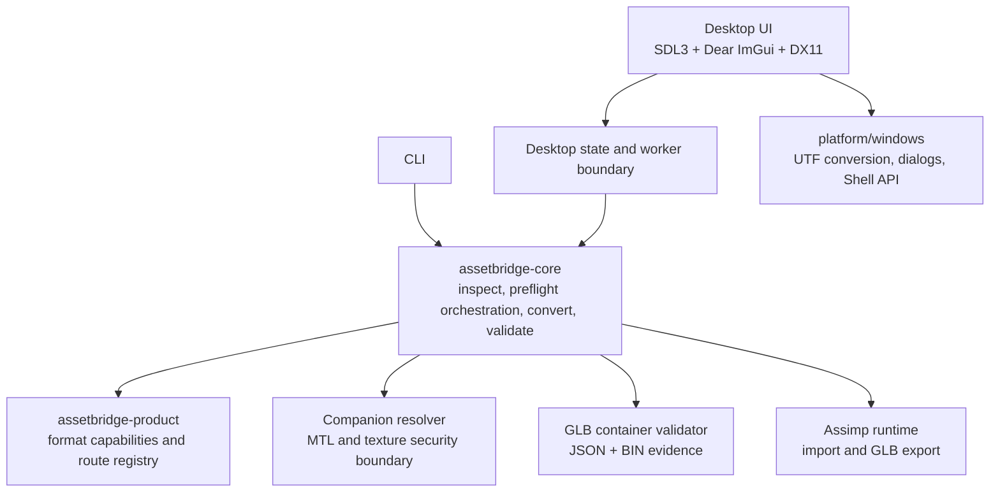

# Architecture

AssetBridge is organized so that desktop presentation cannot become the owner
of conversion policy. The verified boundary remains a product decision expressed
in data and tests, not an accidental consequence of what Assimp can parse.

## Layers

### Product

`assetbridge-product` contains canonical format IDs, the format capability
matrix, loss rules, and the Conversion Route Registry. It has no dependency on
Assimp `aiScene`, the CLI, SDL, ImGui, DirectX, or Windows GUI APIs.

The registry describes a source-target route, not only an output format. In
v0.1.0, OBJ→GLB2 is the only enabled and verified route. Multiple flat static
meshes are verified; meaningful hierarchy and instancing remain separate
blocking features.

The v0.2 development registry adds four route-level facts only for OBJ→GLB2:
multiple referenced materials, Base Color textures, embedded Base Color images,
and shared-image deduplication. External-texture assessment additionally
requires Core evidence that companion analysis completed; runtime exporter
availability alone cannot satisfy this condition.

### Core

`assetbridge-core` owns filesystem-path inspection, Assimp scene analysis,
preflight report creation, conversion transactions, export-ready snapshots,
companion resolution, explicit texture embedding, GLB container inspection,
round-trip validation, and text/JSON serialization. It has no GUI dependency
and can be called directly by the CLI or desktop worker.

The OBJ companion resolver evaluates only materials referenced by source
meshes. `map_Kd` paths are resolved relative to the declaring MTL, but every MTL
and image must remain inside the OBJ directory after lexical and canonical path
checks. The resolver validates file type, PNG/JPEG signatures, transparency and
unsupported semantics, and named resource limits before any output transaction.

Assimp's runtime exporter is not trusted to discover or embed external files.
Core creates compressed `aiTexture` entries from the resolver's bounded byte
payloads and rewrites verified material references to `*N`. A separate GLB
container validator checks JSON/BIN structure and exact image bytes before the
normal Assimp reimport path.

### Desktop and platform

The desktop executable draws state and sends bounded requests to Core. It never
launches the CLI and does not reimplement conversion. SDL3 handles the window,
events, DPI, and drag-and-drop; Dear ImGui draws the interface; DirectX 11
renders it. Windows-only dialogs, UTF conversion, and Shell calls live under
`src/platform/windows`.

## Three capability facts

AssetBridge keeps these facts independent:

- `runtime_available`: the current Assimp build exposes an importer/exporter.
- `product_enabled`: AssetBridge allows the route in the product.
- `verified`: automated and local acceptance tests cover the promised route.

An Assimp exporter can be runtime-available while AssetBridge continues to mark
the route disabled and unverified. This prevents the GUI and documentation from
advertising unsupported conversion paths.

## Transactional output

Each conversion selects a non-existing final asset directory. Work happens in a
`.assetbridge-tmp-*` sibling below the requested output root. The GLB is
exported, reimported, and validated there. The JSON report is written only after
validation data exists. A directory rename commits the transaction; failures
remove temporary content and do not leave a final directory.

Existing output is never overwritten. Name collisions use `_2`, `_3`, and
subsequent suffixes.

## Thread ownership

The SDL event loop, Dear ImGui calls, and DirectX calls stay on the main thread.
Inspection and conversion run on one worker thread. The worker publishes a
completed result through controlled state protected by atomics and a mutex.
The UI reports real coarse stages—Inspecting, Converting, and Validating—rather
than inventing a per-vertex percentage. Only one task may run at a time, and
shutdown joins the worker before graphics and window teardown.

## Version and package boundaries

`project(AssetBridge VERSION 0.1.0)` is the authoritative version source.
CMake configures `assetbridge/version.hpp` for CLI and desktop use. Install
rules gather the two product executables, runtime dependencies, Microsoft
redistributable DLLs discovered by the official CMake module, and license
files. CPack creates a versioned ZIP and SHA-256 checksum without embedding a
build timestamp or local path in product version output.
