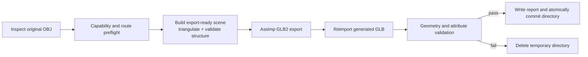

# Validation Pipeline

AssetBridge treats conversion as a transaction with evidence, not as a file
extension change or a successful exporter return code.

## 1. Original asset inspection

The input remains a `std::filesystem::path` at the Windows UTF-16 boundary.
Inspection verifies that the file exists, imports it through Assimp, and records
the source summary and actually present features. Preflight does not report
loss for features the source does not contain.

## 2. Capability and route preflight

The product registry evaluates the canonical OBJ→GLB2 route independently from
Assimp runtime enumeration. A route is convertible only when it is enabled and
verified and every detected source feature is inside the tested commitment.
Unsupported or unverified features produce stable diagnostic codes before an
output transaction begins.

## 3. Export-ready source

The raw OBJ summary is not used as the expected output geometry. The conversion
import applies only the declared preparation steps:

- `aiProcess_Triangulate`
- `aiProcess_ValidateDataStructure`

It does not generate normals or tangents, merge meshes, optimize meshes, change
coordinate handedness, flip UVs, or change units. A validation snapshot is
created from the exact scene about to be exported.

### Source triangles versus export-ready triangles

`source_triangle_face_count` counts faces that were already triangles in the
original OBJ. A quad is one source face and zero source triangle faces. After
controlled triangulation, that quad contributes two export-ready triangles.
Reports preserve both values so a quad-only model is not misrepresented as
having no geometry.

## 4. GLB export and reimport

Assimp's `glb2` exporter writes the candidate file inside the temporary asset
directory. A zero-length or missing output fails immediately. AssetBridge then
imports the generated GLB as a new scene; successful export alone is not enough.

## 5. Validation checks

The reimported scene is checked for:

- Non-empty mesh count exactly matching the export-ready source.
- No silent collapse of independent meshes.
- Valid three-index faces and in-range indices.
- Per-mesh and total triangle counts.
- Finite vertex, normal, UV, and transform values.
- Whole-scene AABB center and size within defined tolerance.
- Per-mesh AABB, normal presence, and UV0 presence.
- Referenced material existence and the currently verified diffuse color.

Mesh order is not assumed stable. Matching uses triangle count and world-space
AABB, prefers exact non-empty names, and uses the lowest unmatched output
ordinal as a deterministic tie-break for duplicate or empty names. The report
records the strategy.

## Why vertex count is diagnostic

OBJ and GLB can represent attribute seams differently. Legal triangulation or
an exporter may split vertices at UV, normal, or material boundaries without
changing the rendered surface. Requiring strict vertex equality would create
false failures and encourage unsafe mesh welding. AssetBridge records source
and output vertex counts, but its geometric contract uses topology validity,
triangle counts, bounds, and required attribute presence.

## 6. Atomic commit

After every check passes, AssetBridge writes `conversion-report.json` and
renames the temporary directory to the selected final directory. Validation or
filesystem failure rolls back the temporary directory. Tests assert that
successful and failed conversions leave no `.assetbridge-tmp-*` residue.
